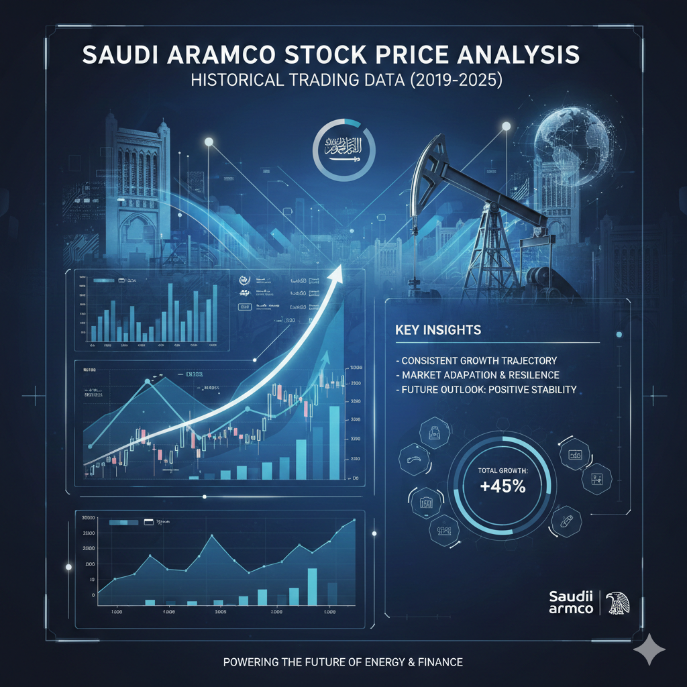

  

# 📊 Saudi Aramco Stock Price Dataset (2019–2025)

## 🔍 Overview
- **Company:** :contentReference[oaicite:0]{index=0}  
- **Ticker:** 2222.SR  
- **Exchange:** :contentReference[oaicite:1]{index=1}  
- **Coverage:** Dec 11, 2019 – Dec 31, 2025  
- **Frequency:** Daily (business days)  
- **Records:** 1,517 rows  
- **Sector:** Energy / Oil & Gas  

## 📁 Dataset Structure
- **Columns (8):** Date, Price, Open, High, Low, Close, Volume, Ticker  
- **Currency:** Saudi Riyal (SAR)  
- **Format:** CSV (UTF-8)

## 📈 What the Data Covers
- IPO period & early volatility (2019)
- COVID-19 crash & oil price war (2020)
- Post-pandemic recovery (2021–2022)
- Energy crisis & peak prices (2022)
- Market stabilization (2023–2025)

## 🧠 Key Challenges
- High volatility & multiple market regimes  
- Limited historical depth (post-IPO only)  
- Strong geopolitical & oil-price dependency  
- Missing dividends & corporate actions  
- Possible future/estimated data (late 2025)

## ✅ Recommended Use Cases
- Time-series forecasting (ARIMA, LSTM, Prophet)
- Technical & volatility analysis
- Event studies (COVID-19, geopolitics)
- ML models & trading strategy backtesting
- Financial dashboards & research

## ⚠️ Limitations
- No fundamentals (earnings, ratios)
- No intraday data
- Needs oil price & macro data for full analysis

## 📌 Source
- Tadawul (Saudi Stock Exchange)  
- Public market data providers (e.g., Yahoo Finance)

## 📜 License
- **CC BY-NC-SA 4.0** (Non-commercial, attribution required)

> *For research and educational use only. Verify with official sources before investment decisions.*
